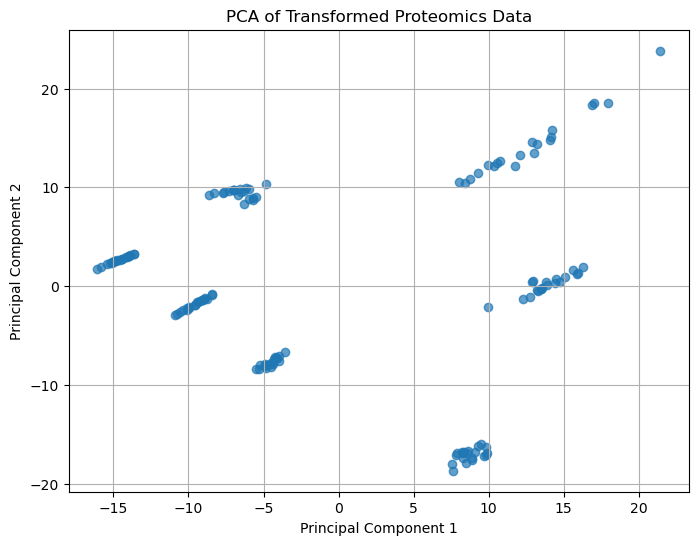
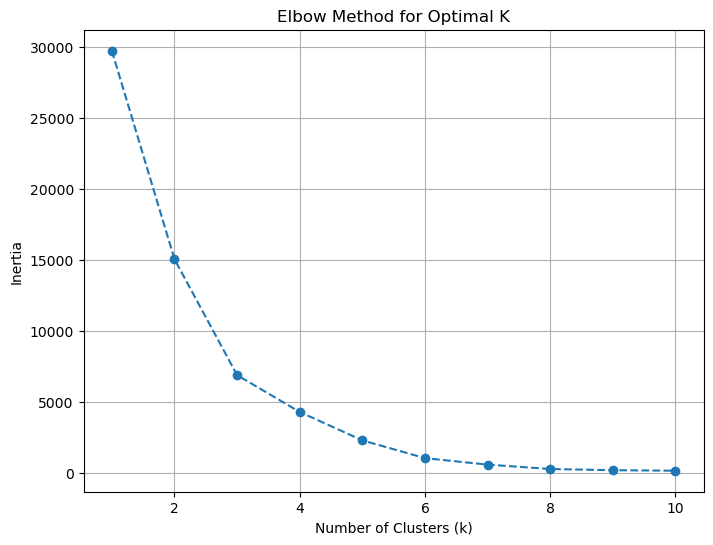
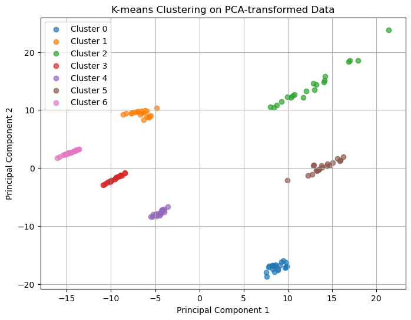

### 1. Clinical Metadata:
This dataset contains detailed patient information, including:
- **Demographic Data:** Age, gender, ethnicity, smoking history.
- **Tumor Characteristics:** Size, histological grade, lymph node involvement, metastasis.
- **Treatment Outcomes:** Treatment type, response to treatment, survival status, follow-up durations.

It provides a comprehensive view of patient profiles, offering opportunities to explore correlations with subpopulations and treatment outcomes.

### 2. Proteomics Dataset:
- We have performed proteomics analysis on tumor samples.
- The dataset includes protein abundance levels for **140 patients**.
- **Structure:** Each row represents a protein, and each column corresponds to a patient.

This dataset will allow you to perform **subpopulation identification** and **feature selection**.

---

### Level 1 - Subpopulation Identification:

In this phase, we are designing and executing an AI pipeline to identify different subpopulations among the **140 patients** with varying stages of bladder cancer in the provided Omics dataset.

**Pipeline Description**
1. **PCA**, for dimensionality reduction to overview potential clusters. We observe there are $7$ *distinguishable* clusters. 

2. **K-Means Clustering** find the cluster assignment.
  1. We display an **Elbow Plot**, for different number of clusters *(e.g. testing that 7 clusters holds)*  

 
  2. We display the cluster assignment for the PCA-transformed data, and validate that it is correct.
 

3. **Cluster Correlation with Metadata** to identify patterns for each cluster found previously. 

| **Cluster** | **Gender**                    | **Ethnicity**                           | **Smoking History**            | **Metastasis**                     |
|-------------|--------------------------------|------------------------------------------|---------------------------------|-------------------------------------|
| **0**       | Male-dominated (17 M, 3 F)    | Predominantly Asian (11)                | Mostly smokers (14)            | No metastasis (100% No)            |
| **1**       | Male-dominated (14 M, 6 F)    | Balanced mix; Caucasian dominant (8)    | Mix (12 Yes, 8 No)             | Mostly no metastasis (16 No, 4 Yes)|
| **2**       | Male-dominated (15 M, 5 F)    | Evenly distributed; Caucasian (6)       | Balanced (10 Yes, 10 No)       | No metastasis (100% No)            |
| **3**       | Male-dominated (14 M, 6 F)    | Predominantly Caucasian (10)            | Most are smokers (15 Yes)      | Mixed (9 No, 11 Yes)               |
| **4**       | Male-dominated (13 M, 7 F)    | Predominantly Caucasian (11)            | Mostly smokers (13 Yes)        | Mostly no metastasis (16 No, 4 Yes)|
| **5**       | Male-dominated (14 M, 6 F)    | Diverse; mix of ethnicities (Caucasian 6, Other 5) | Balanced (12 Yes, 8 No) | No metastasis (100% No)            |
| **6**       | Slight male dominance (12 M, 8 F) | Diverse; mix of ethnicities (Caucasian 8, African-American 5) | Mostly smokers (12 Yes) | Metastasis-dominated (15 Yes, 5 No)|

### Level 2 - Feature Detection:

In this phase, we employ a **feature detection AI algorithm** to identify specific features (e.g., proteins) that distinguish or separate the patient subgroups identified in Level 1.

**Pipeline Description**
1. Data Pre-processing
2. PCA correlations
3. Random Forest Classifier **RFC** to find features.

<table border="1" class="dataframe">
  <thead>
    <tr style="text-align: right;">
      <th></th>
      <th>Protein</th>
      <th>Importance</th>
    </tr>
  </thead>
  <tbody>
    <tr>
      <th>2821</th>
      <td>TFRC</td>
      <td>0.021645</td>
    </tr>
    <tr>
      <th>1617</th>
      <td>MAPT</td>
      <td>0.021620</td>
    </tr>
    <tr>
      <th>430</th>
      <td>CCNB1</td>
      <td>0.021097</td>
    </tr>
    <tr>
      <th>1664</th>
      <td>MMP14</td>
      <td>0.019132</td>
    </tr>
    <tr>
      <th>681</th>
      <td>CXCR4</td>
      <td>0.019107</td>
    </tr>
    <tr>
      <th>311</th>
      <td>BIRC5</td>
      <td>0.018416</td>
    </tr>
    <tr>
      <th>1744</th>
      <td>MYC</td>
      <td>0.017974</td>
    </tr>
    <tr>
      <th>659</th>
      <td>CTNNB1</td>
      <td>0.016988</td>
    </tr>
    <tr>
      <th>2695</th>
      <td>SPP1</td>
      <td>0.016553</td>
    </tr>
    <tr>
      <th>196</th>
      <td>APOE</td>
      <td>0.016540</td>
    </tr>
    <tr>
      <th>432</th>
      <td>CCNE1</td>
      <td>0.016449</td>
    </tr>
    <tr>
      <th>474</th>
      <td>CDKN1A</td>
      <td>0.016080</td>
    </tr>
    <tr>
      <th>2570</th>
      <td>SERPINE1</td>
      <td>0.013881</td>
    </tr>
    <tr>
      <th>3027</th>
      <td>UPK3A</td>
      <td>0.013851</td>
    </tr>
    <tr>
      <th>154</th>
      <td>ANXA1</td>
      <td>0.012633</td>
    </tr>
    <tr>
      <th>1009</th>
      <td>FGFR3</td>
      <td>0.012105</td>
    </tr>
    <tr>
      <th>1058</th>
      <td>GADD45A</td>
      <td>0.010767</td>
    </tr>
    <tr>
      <th>1879</th>
      <td>NRP1</td>
      <td>0.010207</td>
    </tr>
    <tr>
      <th>1035</th>
      <td>FN1</td>
      <td>0.009486</td>
    </tr>
    <tr>
      <th>429</th>
      <td>CCNA2</td>
      <td>0.008797</td>
    </tr>
  </tbody>
</table>

4. Optimal no. of Features.

---

